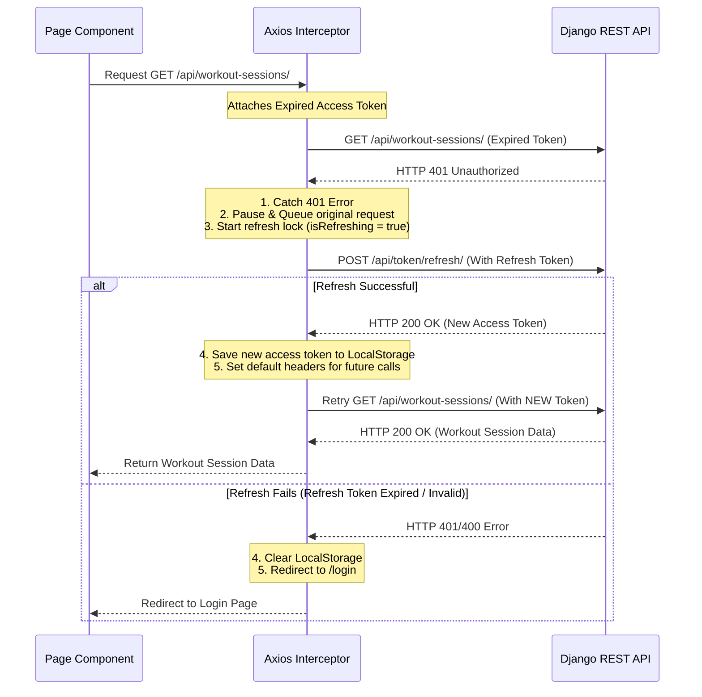

# Gym Tracker — Full-Stack Integration & Architecture Guide

Welcome to the **Gym Tracker** Full-Stack Development & Architecture Guide! 

This document serves as an educational resource to explain exactly how the backend (Django REST Framework) and the frontend (Next.js & TypeScript) communicate, how we handle authentication, caching, and state synchronization, and the details of the fitness calculations and custom code we have developed.

---

## 1. High-Level System Architecture

Gym Tracker is structured as a **decoupled web application** (Single Page Application architecture) with a complete separation of concerns:
1. **DRF Backend**: Enforces data modeling, performs complex sports science calculations, handles database persistence, and serves data over JSON APIs.
2. **Next.js Frontend**: Dynamically renders the User Interface (UI), manages local authentication state, and synchronizes server state using React Query.

```mermaid
graph TD
    subgraph Frontend (Next.js Client)
        UI[React Components & Hooks]
        RQ[React Query Cache]
        AC[Auth Context & JWT Storage]
        AX[Axios Client with Interceptors]
    end
    
    subgraph Backend (Django REST Framework)
        UR[Django URL Router]
        VI[API Views & ViewSets]
        SR[DRF Serializers]
        MD[Django Models]
        DB[(SQLite / PostgreSQL Database)]
    end

    UI -->|Use State| RQ
    RQ -->|Fetch/Mutate| AX
    AC -->|Attach Access Token| AX
    AX -->|REST Requests over HTTP| UR
    UR -->|Route to| VI
    VI -->|Validate & Deserialize| SR
    SR -->|Query / Save| MD
    MD -->|Read/Write| DB
```

---

## 2. Connecting Backend and Frontend: Authentication Flow

Connecting a decoupled frontend to a backend requires a secure way to verify the user's identity. We use **JSON Web Tokens (JWT)** for stateless authentication.

### The Problem with Short-Lived Tokens
For security, **Access Tokens** should be short-lived (e.g., 5 minutes). If an attacker steals it, they only have a 5-minute window to use it. However, forcing the user to log in manually every 5 minutes is a terrible user experience.
To solve this, we use **Refresh Token Rotation**. When the client logs in, it receives:
- **Access Token**: Short-lived, used in every request header (`Authorization: Bearer <access_token>`).
- **Refresh Token**: Long-lived (e.g., 7 days), saved in local storage, used *only* to request new access tokens when the old ones expire.

### The Axios Response Interceptor (The Magic Link)
We configured an Axios interceptor in [api.ts](../frontend/src/lib/api.ts) to automatically refresh expired access tokens. This operates entirely in the background without interrupting the user.

Here is the exact sequence of events when an access token expires:



### Implementing the Interceptor Queue
If a dashboard page loads 5 widgets simultaneously, and the access token has expired, all 5 widgets will trigger a `401 Unauthorized` response at the same time. If we aren't careful, the frontend will fire 5 duplicate requests to `/api/token/refresh/`.

To prevent this, the interceptor uses a lock variable (`isRefreshing`) and a `failedQueue` array:
1. The **first** request to fail triggers the refresh cycle. It sets `isRefreshing = true`.
2. The other 4 failing requests are converted into pending `Promises` and pushed into the `failedQueue`.
3. When the refresh request completes, we call `processQueue(null, newAccess)`. This resolves all 4 pending promises in the queue with the new token, retrying them simultaneously.
4. If the refresh fails, we reject all promises in the queue and clear storage.

---

## 3. Data Synchronization & Caching with React Query

We integrated **React Query (TanStack Query)** in the frontend to manage server-state caching, loading/error states, and automated background syncing.

### Why React Query?
Without it, you have to write standard `useEffect` hooks, manage loading/error state in `useState`, and refetch data manually whenever a user performs a modifying action (a mutation). 
React Query abstracts this away:
- **Cache Isolation**: Queries are cached using keys (e.g., `['workouts']`, `['analytics', 'prs']`).
- **State Reuse**: If multiple components request the same cache key, React Query only triggers *one* API call and shares the cached results, preventing database overload.
- **Declarative Mutations**: When adding, editing, or deleting data, we use a *mutation* that automatically invalidates stale queries to trigger a background refetch.

### Cache Invalidation Example
When a user adds a new exercise set inside a workout, we call the `useCreateExerciseSet` mutation. To ensure the user's dashboard charts immediately update, we tell React Query to invalidate all relevant keys:

```typescript
export function useCreateExerciseSet() {
  const queryClient = useQueryClient();

  return useMutation({
    mutationFn: async (set: Omit<ExerciseSet, "id" | "created_at">) => {
      const { data } = await api.post<ExerciseSet>("/exercise-sets/", set);
      return data;
    },
    onSuccess: (data) => {
      // Invalidate the cache for this specific workout session details
      queryClient.invalidateQueries({ queryKey: ["workouts", data.workout_session] });
      // Invalidate analytics and intelligence since volume & records changed
      queryClient.invalidateQueries({ queryKey: ["analytics"] });
      queryClient.invalidateQueries({ queryKey: ["intelligence"] });
    },
  });
}
```
Thanks to this cache invalidation, React Query automatically pulls fresh metrics in the background and re-renders the charts with zero layout shift or manual page reloads!

---

## 4. What We Have Built (Deep-Dive)

Here is a breakdown of the database, admin, math calculations, and frontend systems we developed.

### A. Database Models & User Isolation (`workouts/models.py`)
We defined four primary models:
1. **Exercise**: Contains a `name` and a `muscle_group` choice field (Chest, Back, Legs, etc.), linked to the `User` who created it.
2. **WorkoutSession**: Holds a training session's `title`, `workout_type` (Push, Pull, Legs, etc.), `date`, and general `notes`.
3. **ExerciseSet**: Connects to a `WorkoutSession` and an `Exercise`. It stores the `set_number`, `weight`, and `reps`.
4. **BodyWeightEntry**: Stores daily bodyweight entries. To prevent users from entering multiple bodyweight logs on the same day, we enforced a database-level uniqueness constraint:
   ```python
   class Meta:
       ordering = ['-date']
       unique_together = ('user', 'date')
   ```

### B. Custom Admin Customizations (`workouts/admin.py`)
To make administrative management robust and clean, we configured:
- **Tabular Inlines**: Declared `ExerciseSetInline` inside `WorkoutSessionAdmin` so that admins can edit and review all sets inside a workout session on a single page, instead of clicking back and forth.
- **Raw ID Fields**: Declared `raw_id_fields = ['user', 'exercise', 'workout_session']` to use pop-up search selectors instead of loading heavy dropdown list inputs.

### C. Sports Science & Mathematics Engine (`analytics.py` & `intelligence.py`)

We implemented several advanced fitness intelligence and mathematical models in Python:

#### 1. Estimated 1-Rep Max (1RM)
To track strength without requiring a user to attempt dangerous 1-rep maximum weights, we estimate their 1RM using the **Epley Formula**:

$$\text{1RM} = \text{weight} \times \left(1 + \frac{\text{reps}}{30}\right)$$

*Example*: If a user bench presses $100\text{ kg}$ for $10\text{ reps}$, their estimated 1RM is:
$$100 \times \left(1 + \frac{10}{30}\right) = 100 \times 1.333 = 133.33\text{ kg}$$

#### 2. Plateau Detection
To check if a user is stuck on a specific exercise, we analyze their 1RM progress:
- We retrieve their historical 1RM estimates for the target exercise.
- We divide the history into the **last 3 sessions** and all **prior sessions**.
- If the maximum 1RM achieved during the last 3 sessions is less than or equal to the maximum 1RM achieved prior to those sessions, the exercise is marked as plateaued (`is_plateaued = True`).
- We calculate the time elapsed since their last peak performance date to help them track stagnation.

#### 3. Muscle Group Imbalances
To check for muscular imbalances and prevent injury, we analyze volume (weight $\times$ reps) logged in the last 30 days:
- We compute total volume for antagonist groups:
  - **Chest vs. Back**
  - **Biceps vs. Triceps**
  - **Upper Body vs. Lower Body**
- We calculate ratios. A healthy balance ratio is set between $0.8$ and $1.25$ (or up to $1.5$ for Upper/Lower). Ratios outside these bounds alert the user on their dashboard.

#### 4. Recovery & Overtraining Analysis
Calculates a recovery score based on:
- **Frequency**: Consecutive days trained. If consecutive training days exceed 5, it raises a `risk_of_overtraining` flag.
- **Volume Spikes**: Compares this week's total volume against the average of the previous three weeks. A volume spike ratio greater than $1.5$ triggers a warning.

#### 5. Daily Bodyweight Change Assessment
Computes weight trends over a 30-day window:
- Retrieves weight logs from the last 30 days.
- Calculates total weight delta and compiles a weekly rate of change:
  $$\text{Rate per Week} = \frac{\text{Weight}_{\text{latest}} - \text{Weight}_{\text{earliest}}}{\left(\frac{\text{Days}_{\text{diff}}}{7.0}\right)}$$
- Returns structured feedback (e.g., "You are losing weight at an average rate of 0.4kg per week.").

---

## 5. Development Lessons Learned

### Handling DRF UniqueTogetherValidator
When adding the `unique_together` constraint on `BodyWeightEntry` for `('user', 'date')`, we wanted the user field to be automatically set to the currently logged-in user in the background.

Initially, we set `user` inside the view's `perform_create` method. However, DRF's serializer validation runs *before* `perform_create` is called. Because the `user` field was missing from the POST payload, DRF's `UniqueTogetherValidator` failed to detect the user, throwing validation exceptions!

We resolved this by using DRF's `CurrentUserDefault` class inside the serializer definition. This ensures the user field is populated during deserialization, allowing the uniqueness validator to verify data successfully:
```python
class BodyWeightEntrySerializer(serializers.ModelSerializer):
    user = serializers.HiddenField(default=serializers.CurrentUserDefault())

    class Meta:
        model = BodyWeightEntry
        fields = ['id', 'user', 'weight', 'date', 'created_at']
```

---

## 6. How to Run Locally

### Running the Backend
1. Activate the virtual environment:
   ```bash
   source venv/bin/activate
   ```
2. Run migrations:
   ```bash
   python backend/manage.py migrate
   ```
3. Run the development server:
   ```bash
   python backend/manage.py runserver
   ```
   The backend will run at `http://127.0.0.1:8000/`.

### Running the Frontend
1. Open a new terminal in the `frontend` folder.``````````````````````````````````````````````````````````````````````````````````````````````````````111
2. Start the dev server:
   ```bash
   npm run dev
   ```
   The frontend will run at `http://localhost:3000/`.

---

Happy coding and training! If you need to make changes to calculations or frontend views, refer back to this guide to see how the data flows.
